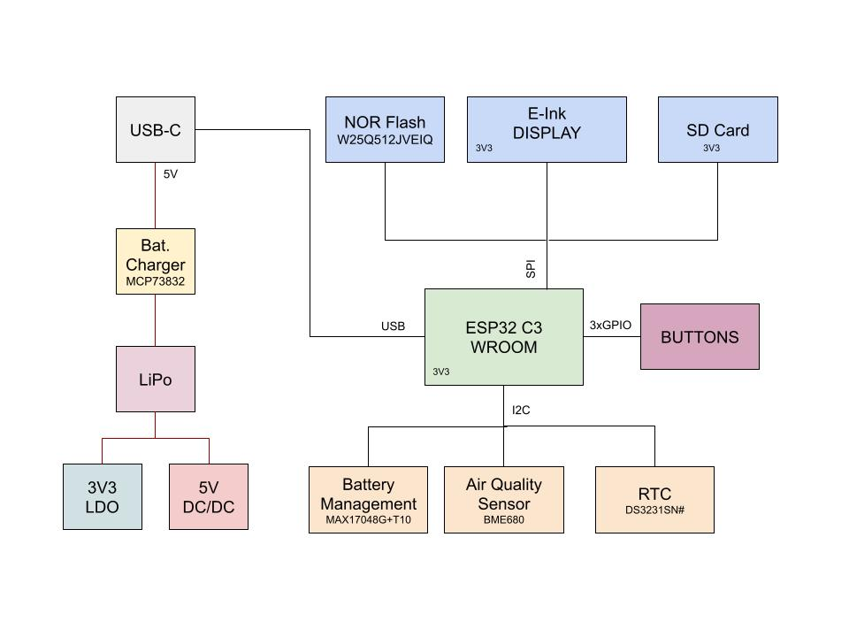
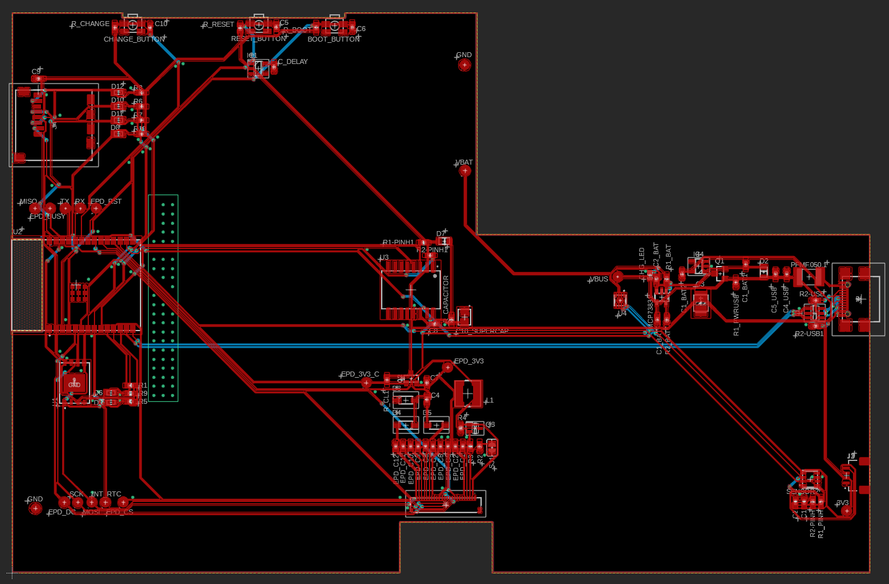
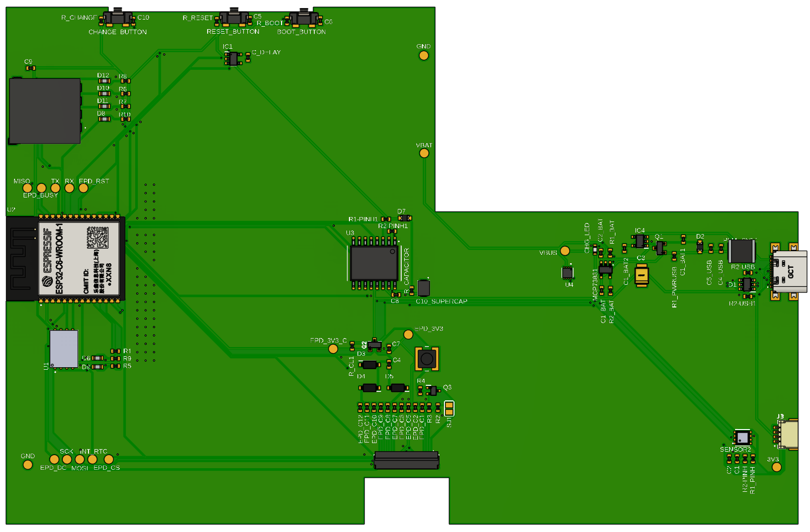
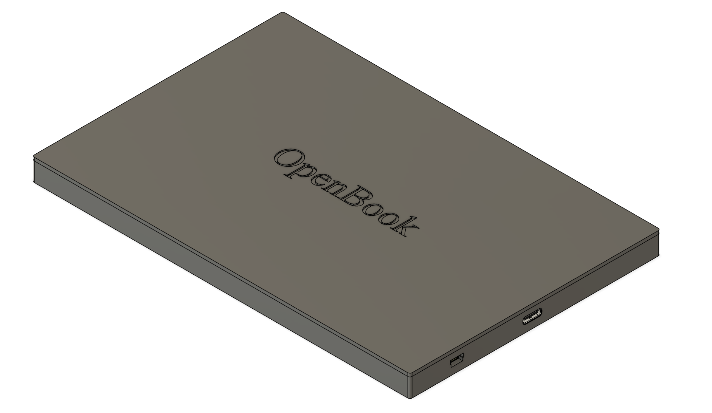
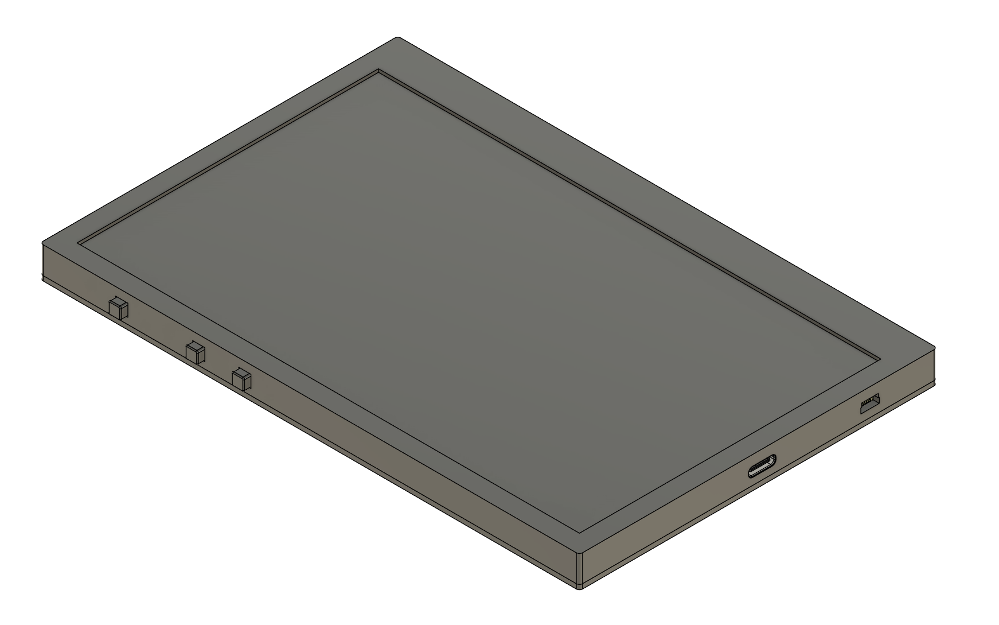
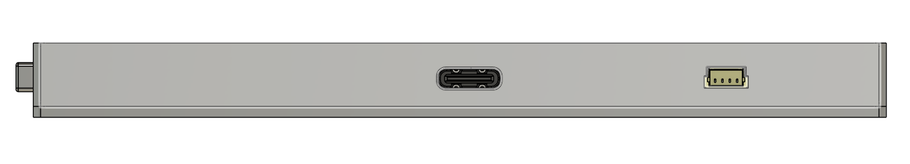
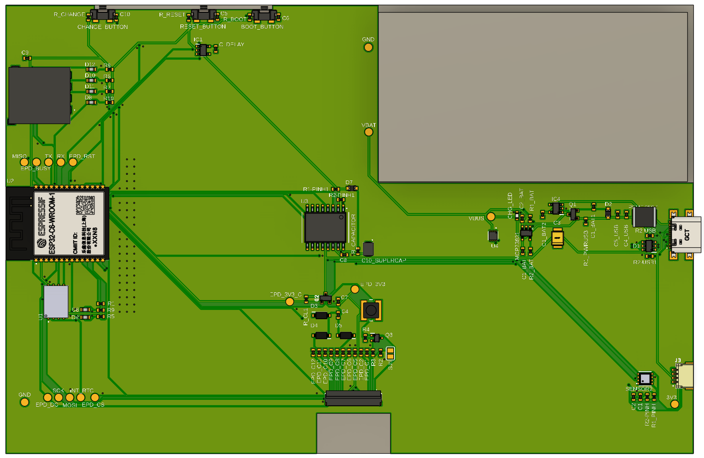

Biro Anya-Andreea 332CA

# OpenBook

## Diagrama bloc

## BOM
| Componenta              | Descriere                             | Sursa | Datasheet |
|-------------------------|----------------------------------------|--------|-----------|
| ESP32-C6-WROOM-1-N8     | Multiprotocol Module ESP32             |[Mouser](https://ro.mouser.com/ProductDetail/Espressif-Systems/ESP32-C6-WROOM-1-N8?qs=8Wlm6%252BaMh8ST02Gmwp74cw%3D%3D)|[Datasheet](https://ro.mouser.com/datasheet/2/891/Espressif_ESP32_C6_WROOM_1__Datasheet_V0_1_PRELIMI-3239987.pdf)|
| USB4110-GF-A            | USB Type C Connector                   |[Mouser](https://ro.mouser.com/ProductDetail/GCT/USB4110-GF-A?qs=KUoIvG%2F9IlYiZvIXQjyJeA%3D%3D)|[Datasheet](https://ro.mouser.com/datasheet/2/837/GCT_USB4110_Product_Drawing___20k_cycles-3455479.pdf)|
| 112A-TAAR-R03           | Micro SD Card Socket                   |[Comet](https://store.comet.srl.ro/Catalogue/Product/43497/)|[Datasheet](https://store.comet.bg/download-file.php?id=27596)|
| BME680                  | Air Quality Sensor                     |[Mouser](https://ro.mouser.com/ProductDetail/Bosch-Sensortec/BME680?qs=v271MhAjFHjo0yA%2FC4OnDQ%3D%3D)|[Datasheet](https://ro.mouser.com/datasheet/2/783/BST_BME680_DS001-1509608.pdf)|
| DS3231SN#               | Real Time Clock                        |[Mouser](https://ro.mouser.com/ProductDetail/700-DS3231SN%23)|[Datasheet](https://ro.mouser.com/datasheet/2/609/DS3231-3421123.pdf)|
| EVQ-P4MB3K              | Tactile Switch                         |[Mouser](https://ro.mouser.com/ProductDetail/Panasonic/EVQ-P4MB3K?qs=0aNVN3t2tDvlcmyoDZjvlA%3D%3D)|[Datasheet](https://4donline.ihs.com/images/VipMasterIC/IC/PANA/PANA-S-A0000771493/PANA-S-A0000771493-1.pdf?hkey=CECEF36DEECDED6468708AAF2E19C0C6)|
| MCP73831-2ACI/MC        | Battery Charge Controller              |[Mouser](https://ro.mouser.com/ProductDetail/579-MCP73831-2ACI-MC)|[Datasheet](https://ro.mouser.com/datasheet/2/268/MCP73831_Family_Data_Sheet_DS20001984H-3441711.pdf)|
| MAX17048G+T10           | Battery Management                     |[Mouser](https://ro.mouser.com/ProductDetail/Analog-Devices-Maxim-Integrated/MAX17048G%2bT10?qs=D7PJwyCwLAoGnnn8jEPRBQ%3D%3D)|[Datasheet](https://ro.mouser.com/datasheet/2/609/MAX17048_MAX17049-3469099.pdf)|
| FH34SRJ-24S-0.5SH(99)   | EPD Connector                          |[Mouser](https://ro.mouser.com/ProductDetail/Hirose-Connector/FH34SRJ-24S-0.5SH99?qs=vcbW%252B4%252BSTIpKBl5ap9J8Fw%3D%3D&_gl=1*jvg17l*_ga*dW5kZWZpbmVk*_ga_15W4STQT4T*dW5kZWZpbmVk*_ga_1KQLCYKRX3*dW5kZWZpbmVk)|[Datasheet](https://ro.mouser.com/datasheet/2/185/FH34SRJ_24S_0_5SH_99__CL0580_1255_6_99_2DDrawing_0-1615044.pdf)|
| PRT-14417               | Qwiic JST Connector                    |[Mouser](https://ro.mouser.com/ProductDetail/SparkFun/PRT-14417?qs=wd5RIQLrsJhgdz%2FpmZ%2F3GQ%3D%3D)|[Datasheet](https://ro.mouser.com/datasheet/2/813/Qwiic_Connector_Datasheet-1223982.pdf)|
| W25Q512JVEIQ            | NOR Flash                              |[Mouser](https://ro.mouser.com/ProductDetail/Winbond/W25Q512JVEIQ?qs=l7cgNqFNU1jw6svr3at6tA%3D%3D)|[Datasheet](https://ro.mouser.com/datasheet/2/949/Winbond_W25Q512JV_Datasheet-3240039.pdf)|
| R0402                   | Resistor                               |[Mouser](https://ro.mouser.com/ProductDetail/Panasonic/ERJ-2BWJR051X?qs=pojneS%2F1sjx%252Bdeocf%252BMSog%3D%3D)|[Datasheet](https://industrial.panasonic.com/cdbs/www-data/pdf/RDN0000/AOA0000C313.pdf)|
| B72540T0300K062         | Varistor                               |[Mouser](https://ro.mouser.com/ProductDetail/EPCOS-TDK/B72540T0300K062?qs=dEfas%2FXlABK4d0Dv0OnYYg%3D%3D)|[Datasheet](https://www.tdk-electronics.tdk.com/inf/75/db/CTVS_14/Surge_protection_series.pdf)|
| C0402C475K8PACTU        | Capacitor                              |[Mouser](https://ro.mouser.com/ProductDetail/KEMET/C0402C475K8PACTU?qs=ulEaXIWI0c9ebKRT3r3htg%3D%3D)|[Datasheet](https://ro.mouser.com/datasheet/2/447/KEM_C1006_X5R_SMD-3316465.pdf)|
| T491B107M006AT          | Tantalum Capacitor                     |[Mouser](https://ro.mouser.com/ProductDetail/KEMET/T491B107M006AT?qs=U312oeP%2FpiHOgyk6KO2m0g%3D%3D)|[Datasheet](https://ro.mouser.com/datasheet/2/447/KEM_T2005_T491-3316937.pdf)|
| USBLC6-2SC6Y            | ESD Protection Diode                   |[Mouser](https://ro.mouser.com/ProductDetail/STMicroelectronics/USBLC6-2SC6Y?qs=gNDSiZmRJS%2FOgDexvXkdow%3D%3D)|[Datasheet](https://ro.mouser.com/datasheet/2/389/usblc6_2sc6y-1852505.pdf)|
| PGB1010603MR            | ESD Protection Diode                   |[Mouser](https://ro.mouser.com/ProductDetail/Littelfuse/PGB1010603MR?qs=gu7KAQ731URLg4GSnNNN7Q%3D%3D)|[Datasheet](https://www.littelfuse.com/assetdocs/pulseguard-esd-suppressors-pgb1-datasheet?assetguid=8a337998-d54d-466b-be4e-dc5bcd1f9321)|
| SD0805S020S1R0          | Schottky Diode                         |[Mouser](https://ro.mouser.com/ProductDetail/KYOCERA-AVX/SD0805S020S1R0?qs=jCA%252BPfw4LHbpkAoSnwrdjw%3D%3D)|[Datasheet](https://ro.mouser.com/datasheet/2/40/schottky-3165252.pdf)|
| MBR0530-TP              | Small Signal Schottky Diode            |[Mouser](https://ro.mouser.com/ProductDetail/Micro-Commercial-Components-MCC/MBR0530-TP?qs=KFo7JewZbUECRHkxGanrdg%3D%3D)|[Datasheet](https://ro.mouser.com/datasheet/2/258/MBR0520_MBR0580_SOD123_-2492194.pdf)|
| LSM0603472V             | Single Color LED                       |[Mouser](https://ro.mouser.com/ProductDetail/VCC/LSM0603472V?qs=%252BEew9%252B0nqrBygsW37Z2ISQ%3D%3D)|[Datasheet](https://ro.mouser.com/datasheet/2/423/LSM0603472V_(1)-1379786.pdf)|
| DMG2305UX-7             | MOSFET P-Ch                            |[Mouser](https://ro.mouser.com/ProductDetail/Diodes-Incorporated/DMG2305UX-7?qs=L1DZKBg7t5F%2FNBHrjfxC%252Bg%3D%3D)|[Datasheet](https://www.diodes.com/assets/Datasheets/DMG2305UX.pdf)|
| SI1308EDL-T1-GE3        | MOSFET N-Ch                            |[Mouser](https://ro.mouser.com/ProductDetail/Vishay-Semiconductors/SI1308EDL-T1-GE3?qs=bX1%252BNvsK%2FBramh9tgpOaEw%3D%3D)|[Datasheet](https://www.vishay.com/docs/63399/si1308edl.pdf)|
| CPH3225A                | Supercapacitor                         |[Mouser](https://ro.mouser.com/ProductDetail/Seiko-Semiconductors/CPH3225A?qs=3etwrb1wR%252BhUOph6lAO7eg%3D%3D)|[Datasheet](https://ro.mouser.com/datasheet/2/360/Seiko_Instruments_MicroBattery_E_20230330_2024Jan_-3561061.pdf)|
| 744043680               | SMD Inductor                           |[Mouser](https://ro.mouser.com/ProductDetail/Wurth-Elektronik/744043680?qs=PGXP4M47uW6VkZq%252BkzjrHA%3D%3D)|[Datasheet](https://www.we-online.com/components/products/datasheet/744043680.pdf)|
| BD5229G-TR              | Voltage Detector                       |[Mouser](https://ro.mouser.com/ProductDetail/ROHM-Semiconductor/BD5229G-TR?qs=4kLU8WoGk0vvnhrrYwdszw%3D%3D)|[Datasheet](https://fscdn.rohm.com/en/products/databook/datasheet/ic/power/voltage_detector/bd52xxg-e.pdf)|
| XC6220A331MR-G          | LDO Voltage Regulator                  |[Mouser](https://ro.mouser.com/ProductDetail/Torex-Semiconductor/XC6220A331MR-G?qs=AsjdqWjXhJ8ZSWznL1J0gg%3D%3D)|[Datasheet](https://ro.mouser.com/datasheet/2/760/xc6220-3371556.pdf)|

## Descriere funcționalitate hardware
Proiectul **OpenBook** are ca scop dezvoltarea unui dispozitiv portabil de afișare a informațiilor, cu consum redus de energie, conectivitate Wi-Fi și senzori de mediu.

### Module și interfețe utilizate

- **ESP32-C6** – Microcontroller central cu suport pentru Wi-Fi și BLE. Rulează logica principală și gestionează comunicația cu toate perifericele.
- **BME680** – Senzor pentru calitatea aerului, conectat prin magistrala I2C.
- **DS3231SN** – Ceas de timp real (RTC), conectat I2C.
- **W25Q512JVEIQ** – Memorie NOR Flash SPI pentru stocare de date suplimentară.
- **MAX17048** – Circuit de monitorizare a bateriei, interfață I2C.
- **MCP73831** – Controler de încărcare baterie LiPo.
- **Conector EPD + ecran E-Ink** – Conectat SPI, pentru afișare cu consum redus.
- **Slot microSD** – SPI, pentru citire/scriere fișiere.
- **Buton tactile (EVQ-P4MB3K)** – Intrare digitală, GPIO.
- **Conector USB-C (USB4110-GF-A)** – Încărcare și interfață serială.
- **LED + rezistor + MOSFET** – Indicatoare vizuale, controlate de GPIO.
- **Diodă Schottky, varistori, ESD diode** – Protecție electrică.

### Comunicație și consum

- I2C: folosit pentru BME680, RTC, Battery Gauge
- SPI: utilizat pentru ecranul E-Ink, memoria Flash și SD card
- GPIO: pentru butoane, LED-uri, MOSFET-uri
- UART: pentru debugging via USB
- Estimare consum: 
    - **Mod Activ:** ~220 mA @ 3.3V → ~727 mW  
    - **Mod Sleep:** ~27 µA @ 3.3V → ~0.089 mW  
    - **Autonomie estimată:** ~14 zile cu baterie Li-Po 1200mAh

## Mapare Pini ESP32-C6

| Componentă              | Pin ESP32-C6         | Interfață   |
|-------------------------|----------------------|-------------|
| BME680                  | GPIO4 (SDA), GPIO5 (SCL) | I2C      |
| DS3231SN                | GPIO4, GPIO5         | I2C         |
| E-Ink Display           | GPIO10, GPIO11, ...  | SPI         |
| SD Card                 | GPIO10, GPIO11, ...  | SPI         |
| MAX17048                | GPIO4, GPIO5         | I2C         |
| MCP73831                | GPIO22 (STAT)        | GPIO        |
| Buton                  | GPIO12               | GPIO        |
| LED                    | GPIO13               | GPIO        |
| UART (debug)           | GPIO20 (TX), GPIO21 (RX) | UART    |

## Alte Informații Relevante
- Fișiere schematice și PCB disponibile în `/Hardware`
- Fișiere 3D disponibile în `/Mechanical`
- Randări ale PCB-ului:

- Randări ale dispozitivului:

